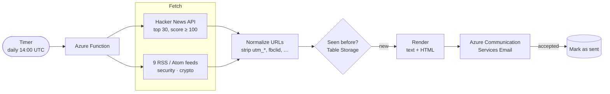

# Tech Briefing

[](https://github.com/meiorz/tech-briefing/actions/workflows/ci.yml)


A serverless daily digest that collects tech, security and crypto news from Hacker News and nine RSS feeds, drops anything it has already sent, and emails me one clean briefing every morning.

It runs on Azure Functions (Flex Consumption) with **no secrets anywhere in the deployment**: every Azure service call uses a managed identity, storage account keys are disabled, and the infrastructure is defined in Bicep.

## How it works



1. **Fetch**: Hacker News stories are fetched in parallel and RSS feeds one after another. A failing source is logged and skipped, and the run only fails if *every* source is down.
2. **Dedupe**: URLs are normalized (scheme, host case, trailing slash, tracking parameters, query order) and hashed with SHA-256 into a Table Storage row key, so the same article shared through different links is only sent once.
3. **Render**: items are grouped by category, newest first, into a plain-text and an HTML version. All feed content is HTML-escaped, and only `http(s)` links are made clickable.
4. **Send, then record**: items are marked as seen only after ACS accepts the email, so a failed send is retried the next day instead of being silently lost.

## Design decisions

| Decision | Why |
|---|---|
| **Managed identity everywhere** | The Function App's system identity reaches Table Storage, Blob Storage (deployment package), Application Insights and ACS through Entra ID. `allowSharedKeyAccess: false` and `DisableLocalAuth: true` make keys unusable, not just unused. |
| **Least-privilege email role** | Instead of the broad built-in *Communication and Email Service Owner*, a custom role grants only the three actions Microsoft documents for sending mail. |
| **Same code, local or cloud** | [`clients.py`](briefing/clients.py) uses a connection string when one is set (Azurite and an ACS key locally) and falls back to `DefaultAzureCredential` in Azure. |
| **Prefer a missed item over a duplicate digest** | If ACS is still processing at the 120s timeout, the send counts as accepted. Only a definite `Failed`/`Canceled` status leaves items unmarked. |
| **Fail loudly, degrade gracefully** | One broken feed doesn't cancel the briefing, but a total outage raises so it shows up as a failed run instead of looking like a quiet news day. |
| **Cost guards** | Flex Consumption scales to zero, max instances is capped at 1, and the Log Analytics workspace has a 1 GB/day hard cap. |

## Project layout

```
function_app.py          Timer trigger: fetch → dedupe → render → send → mark
briefing/
  fetchers/hn.py         Hacker News API (parallel item fetch)
  fetchers/rss.py        RSS/Atom via feedparser, HTML-stripped summaries
  dedupe.py              URL normalization + SHA-256 keys
  store.py               Table Storage "seen" set, batched upserts
  render.py              Plain-text and HTML email bodies
  mailer.py              ACS email send with bounded wait
  clients.py             Connection string locally, managed identity in Azure
  sources.py             Feed list
infra/
  main.bicep             Storage, Function App, App Insights, RBAC
  deploy.ps1             Deploy and clean up the legacy role assignment
scripts/                 Local preview and test-send helpers
tests/                   pytest suite (no network, no Azure needed)
```

## Running locally

Requirements: Python 3.12, [Azure Functions Core Tools v4](https://learn.microsoft.com/azure/azure-functions/functions-run-local), [Azurite](https://learn.microsoft.com/azure/storage/common/storage-use-azurite), and PowerShell 7 for the helper scripts.

```powershell
python -m venv .venv
.venv\Scripts\Activate.ps1
pip install -r requirements-dev.txt
copy local.settings.example.json local.settings.json   # then fill in your ACS values
```

```powershell
azurite --location .azurite --silent        # in a second terminal
./dev.ps1                                   # checks Azurite, activates the venv, runs `func start`
```

Preview the email without sending anything:

```powershell
python -m scripts.preview_email             # writes out/briefing.txt and out/briefing.html
python -m scripts.send_test                 # sends out/ to BRIEFING_RECIPIENT
```

## Tests

```powershell
python -m pytest -q
```

33 tests cover URL normalization, both fetchers (including outages and malformed feeds), the Table Storage dedupe and batching, HTML escaping and unsafe-link handling, the mailer's timeout path, the local-vs-cloud client switch, and the timer function's send/mark ordering. All of them use fakes, so they run offline in a few seconds. CI also checks that the Bicep template compiles.

## Deploying to Azure

Prerequisites: an Azure Communication Services resource with a linked email domain in the target resource group (the template references it as an existing resource), and the Azure CLI logged in with rights to create role assignments.

```powershell
./infra/deploy.ps1 -SenderAddress "DoNotReply@<your-domain>.azurecomm.net" -RecipientAddress "you@example.com"
func azure functionapp publish <functionAppName>   # name is printed by the deploy
```

## Ideas for next steps

- LLM-written "top 3 stories" summary at the start of the digest
- Per-source health metrics and an alert rule on failed runs
- GitHub Actions deployment with OIDC federated credentials (still no secrets)

## License

[MIT](LICENSE)
